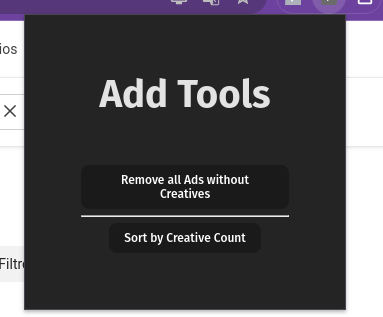
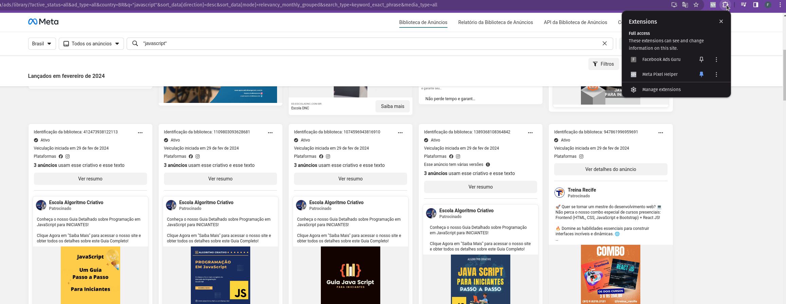

# Ads Tools

This is a small chrome extension to remove facebook ads without creative.

## How to install

1. Download the repository
2. Run `npm install` in the repository folder
3. Run 'npm run build' in the repository folder
4. Open Chrome
5. Go to `chrome://extensions/`
6. Enable `Developer mode`
7. Click on `Load unpacked`
8. Select the repository dist folder
9. Enjoy!

